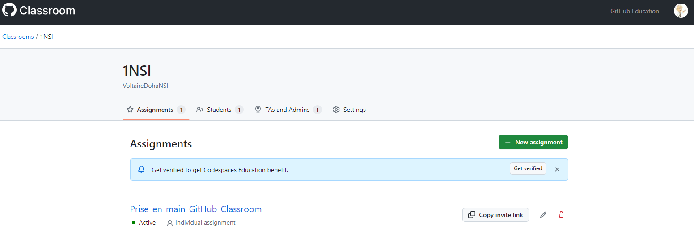
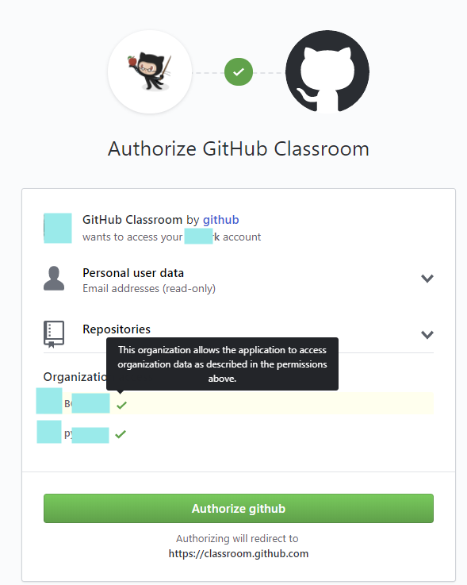
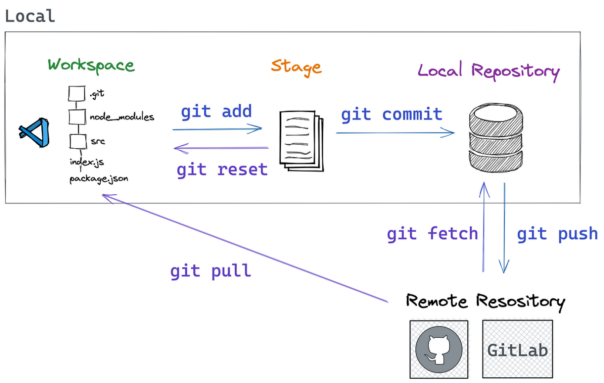
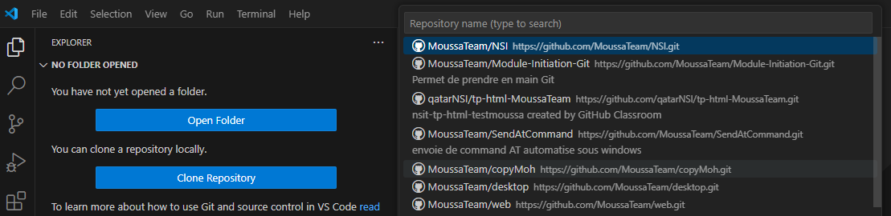
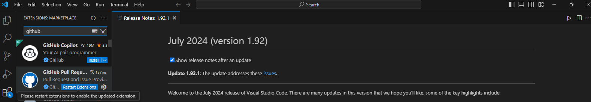
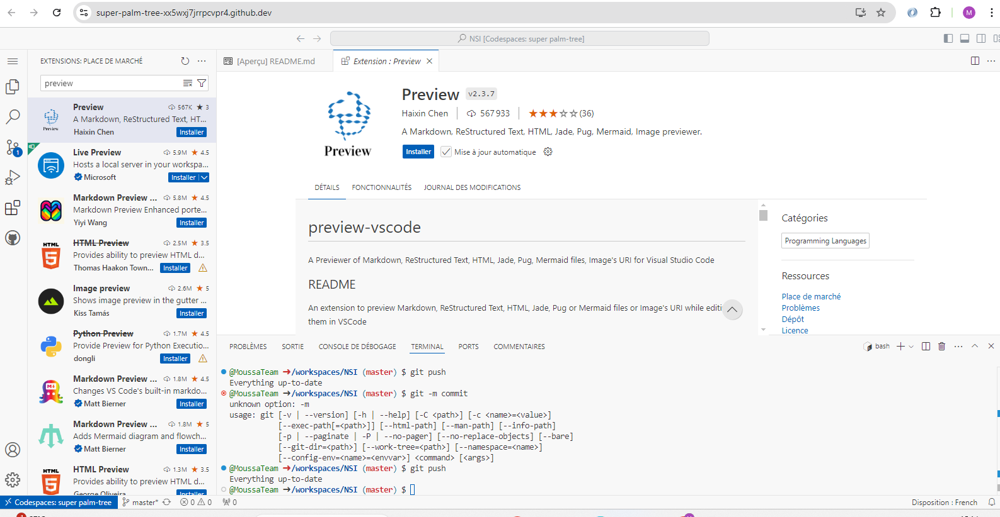
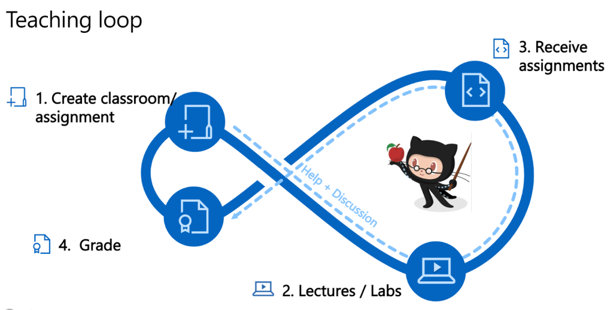

# Récupérer l’assignement (devoir) à faire

Se connecter à Google Classroom et cliquez sur le lien vers GitHub Classroom (accepter l’assignement ( devoir à faire) et créer son compte GitHub (retenez bien le login et mot de passe) , vous avez accès à votre espace étudiants.

# Utilisation à distance via Visual Code ou Visual Codium :

## rapatrier l’assignement (le devoir)

Comme votre professeur vous a créer un repository avec ce nom NSI/repository-votre-nom, vous devez commencer par un **Git Pull** ici **Clone a repository** afin de ramener le repository de GitHub Classroom vers le disque dur de votre machine en local.

Vous cliquez sur Clone Repository vers MesDocuments/NSI/assignement1 sur votre PC en local et autorisez l’accès à votre compte GitHub via le web, il faudra entrer vos login et mot de passe de GitHub.

## Installer les extensions de fichiers et les outils de développement

Installer les extensions en fonction du besoin :

python,

github (pour synchroniser vos données dans le Cloud),

Jupiter (pour lire les fichiers notebook jupiter ),

preview pour pouvoir visualiser les extension web .html et Markdown .md ,

Répondez aux questions dans le fichier questions_versio_hebergt_.md et puis faites un **Commit** avec un commentaire indiquant que vous avez finit et enfin un **Push** pour le sauvegarder sur le GitHub Classroom.

Votre professeur peut ainsi voir votre travail et vous noter !!!

Bienvenue dans le monde de l’informatique !

Pour aller plus loin sur Visual Code et GitHub :

<https://code.visualstudio.com/docs/sourcecontrol/overview>

# Comment se déroule le cycle de travail entre le professeur et les élèves :

-   Votre professeur crée un assignement (Create assignement par le professeur)
-   Vous avez des activités en classe avec le professeur et élèves ( Lectures ans Labs )
-   Vous recevez l’assignement en classe ou à la maison et échangez avec lui (receive assignements)
-   Vous êtes évaluez à la date de réception ( Grade )

