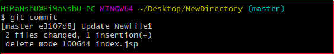
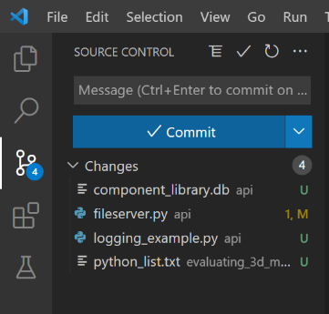
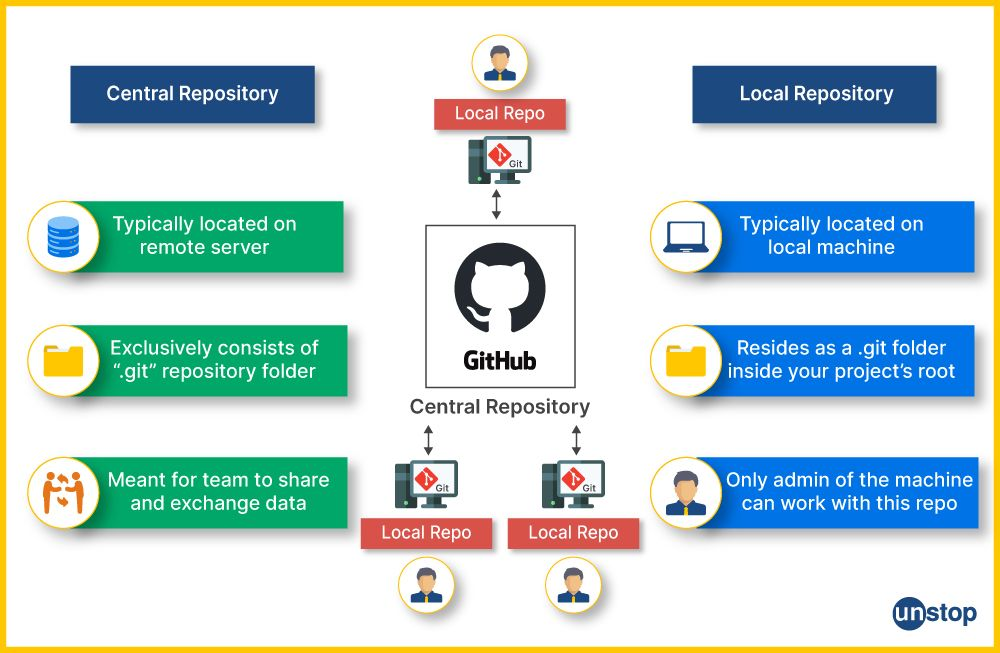
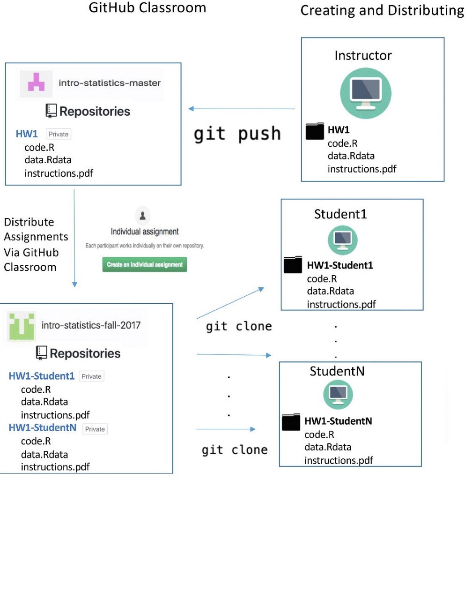

## Comment travailler au lycée et récupérer son travail chez soi facilement ?

## Comment travailler en groupe et échanger ensemble simplement sur notre travail en cours ?

## Comment montrer notre travail au professeur et discuter avec lui sur notre code ?

La solution : Utiliser des outils de versioning utiliser par les professionnels du développement informatique

# L’outil du versionning par excellence **git** !!!

mais c’est en ligne de commande … Aïe … Mince c’est dommage…

-   Trop compliqué pour un début !!!
-   Bon, j’ai évidemment la solution, patientez encore …
-   Nous allons utiliser un Environnement de Développement Intégré (IDE en anglais) qui s’appelle Visual Code qui va nous permettre de faire les commandes mais avec des boutons !!!

 Waouh ! Plutôt cool ! Merci Monsieur ! De rien cadeau !!!

-   Ok mais il va aller où notre travail ?
-   Ben dans le cloud ! Les nuages ! Bon, les nuages de GitHub, c’est une entreprise qui propose de stocker les projets ( repositories ) informatique.

# Un herbergeur de projets informatiques avec versionning : GitHub

Et voilà, à présent on peut travailler sur un poste au lycée, puis faire un commit pour enregistrer les changements et enfin un push pour l’envoyer sur un repository à moi sur un serveur de GitHub !

Ensuite, je me connecte sur mon PC à la maison, je fais un Pull pour récupérer mon repository sur mon PC en local et je fais des modifications, ensuite commit et puis à la fin Push vers le serveur de GitHub !!!

Schéma maison travail

Entendu mais Comment notre « magnifique » professeur va nous distribuer le travail et créer tous nos « repositories » dans GitHub ?

# Création des repositories avec GitHub Classroom :

Votre aimable professeur ( Instructor dans l’image suivante, va distribuer un travail ou assignement) qui sera disponible et cloner pour tous les étudiants de la classe. Le professeur pourra discuter et suivre le travail (commit et push et pull request) de tous les élèves au fur et à mesure de leurs avancements dans les exercices et travaux et projets tout au long de l’année.

Votre aimable professeur vous enverra un lien via **Google Classroom** dans le flux, il faudra accepter l’invitation vers le repository et créer votre compte GitHub afin d’y avoir enfin accès.
